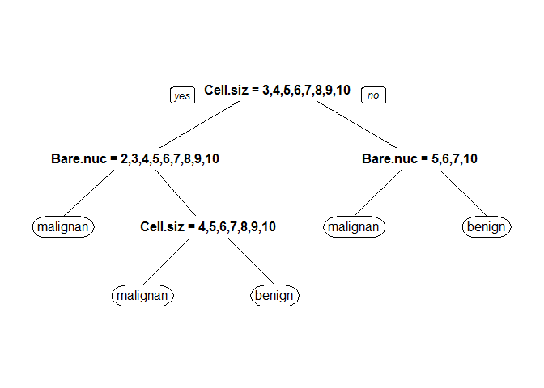

乳癌預測模型
================

資料前處理
==========

資料解釋
--------

此資料來源為UCI Machine Learning Repository。

資料內共紀錄699個病人資料，用來預測病人的乳房腫瘤是良性還是陰性，裡頭包含了11個參數，例如細胞大小等等...。分類結果為二元分類，包刮陰性(malignant)與良性(benign)。

資料讀取
--------

``` r
#install.packages("mlbench")
library(mlbench)
```

    ## Warning: package 'mlbench' was built under R version 3.2.5

``` r
data(BreastCancer)
str(BreastCancer)
```

    ## 'data.frame':    699 obs. of  11 variables:
    ##  $ Id             : chr  "1000025" "1002945" "1015425" "1016277" ...
    ##  $ Cl.thickness   : Ord.factor w/ 10 levels "1"<"2"<"3"<"4"<..: 5 5 3 6 4 8 1 2 2 4 ...
    ##  $ Cell.size      : Ord.factor w/ 10 levels "1"<"2"<"3"<"4"<..: 1 4 1 8 1 10 1 1 1 2 ...
    ##  $ Cell.shape     : Ord.factor w/ 10 levels "1"<"2"<"3"<"4"<..: 1 4 1 8 1 10 1 2 1 1 ...
    ##  $ Marg.adhesion  : Ord.factor w/ 10 levels "1"<"2"<"3"<"4"<..: 1 5 1 1 3 8 1 1 1 1 ...
    ##  $ Epith.c.size   : Ord.factor w/ 10 levels "1"<"2"<"3"<"4"<..: 2 7 2 3 2 7 2 2 2 2 ...
    ##  $ Bare.nuclei    : Factor w/ 10 levels "1","2","3","4",..: 1 10 2 4 1 10 10 1 1 1 ...
    ##  $ Bl.cromatin    : Factor w/ 10 levels "1","2","3","4",..: 3 3 3 3 3 9 3 3 1 2 ...
    ##  $ Normal.nucleoli: Factor w/ 10 levels "1","2","3","4",..: 1 2 1 7 1 7 1 1 1 1 ...
    ##  $ Mitoses        : Factor w/ 9 levels "1","2","3","4",..: 1 1 1 1 1 1 1 1 5 1 ...
    ##  $ Class          : Factor w/ 2 levels "benign","malignant": 1 1 1 1 1 2 1 1 1 1 ...

資料前處理
----------

留下沒有缺值的資料，並把無關病情的資料拿掉(ID)

``` r
BreastCancerC<-BreastCancer[complete.cases(BreastCancer),
!names(BreastCancer) %in% c("Id")] 
c(nrow(BreastCancer),nrow(BreastCancerC))
```

    ## [1] 699 683

### 將資料隨機分為訓練組與測試組

隨機將2/3的資料分到訓練組（Test==F），剩下1/3為測試組（Test==T)

``` r
BreastCancerC$Test<-F 
BreastCancerC[
    sample(1:nrow(BreastCancerC),nrow(BreastCancerC)/3),
    ]$Test<-T 
c(sum(BreastCancerC$Test==F),sum(BreastCancerC$Test==T)) 
```

    ## [1] 456 227

可得訓練組案例數為456測試組案例數為227

預測模型建立
------------

### 模型建立

由於變數多，且多為連續變項，而輸出為二元類別變項，故選擇決策樹演算法來建立模型。

``` r
#install.packages("rpart")
library(rpart)
```

    ## Warning: package 'rpart' was built under R version 3.2.5

``` r
BreastCancerC$Class<-factor(BreastCancerC$Class,levels=c("malignant","benign"))
set.seed(1000)          
fit<-rpart(Class~.,data=BreastCancerC[BreastCancerC$Test==F,]) 
#install.packages("rpart.plot")
library(rpart.plot)
```

    ## Warning: package 'rpart.plot' was built under R version 3.2.5

``` r
summary(fit)
```

    ## Call:
    ## rpart(formula = Class ~ ., data = BreastCancerC[BreastCancerC$Test == 
    ##     F, ])
    ##   n= 456 
    ## 
    ##         CP nsplit rel error  xerror       xstd
    ## 1 0.800000      0   1.00000 1.00000 0.06369472
    ## 2 0.046875      1   0.20000 0.25625 0.03817804
    ## 3 0.012500      3   0.10625 0.19375 0.03359487
    ## 4 0.010000      4   0.09375 0.17500 0.03204044
    ## 
    ## Variable importance
    ##       Cell.size      Cell.shape     Bare.nuclei    Epith.c.size 
    ##              21              17              16              16 
    ##     Bl.cromatin Normal.nucleoli   Marg.adhesion    Cl.thickness 
    ##              15              14               1               1 
    ## 
    ## Node number 1: 456 observations,    complexity param=0.8
    ##   predicted class=benign     expected loss=0.3508772  P(node) =1
    ##     class counts:   160   296
    ##    probabilities: 0.351 0.649 
    ##   left son=2 (174 obs) right son=3 (282 obs)
    ##   Primary splits:
    ##       Cell.size    splits as  RRLLLLLLLL, improve=150.3742, (0 missing)
    ##       Cell.shape   splits as  RRLLLLLLLL, improve=140.2531, (0 missing)
    ##       Bare.nuclei  splits as  RRRLLLLLLL, improve=139.7402, (0 missing)
    ##       Bl.cromatin  splits as  RRRLLLLLLL, improve=131.4800, (0 missing)
    ##       Epith.c.size splits as  RRLLLLLLLL, improve=126.5242, (0 missing)
    ##   Surrogate splits:
    ##       Cell.shape      splits as  RRRLLLLLLL, agree=0.912, adj=0.770, (0 split)
    ##       Epith.c.size    splits as  RRLLLLLLLL, agree=0.901, adj=0.741, (0 split)
    ##       Bare.nuclei     splits as  RRLLLRLLLL, agree=0.877, adj=0.678, (0 split)
    ##       Normal.nucleoli splits as  RRLLLLLLLL, agree=0.875, adj=0.672, (0 split)
    ##       Bl.cromatin     splits as  RRRLLLLLLL, agree=0.873, adj=0.667, (0 split)
    ## 
    ## Node number 2: 174 observations,    complexity param=0.046875
    ##   predicted class=malignant  expected loss=0.1321839  P(node) =0.3815789
    ##     class counts:   151    23
    ##    probabilities: 0.868 0.132 
    ##   left son=4 (149 obs) right son=5 (25 obs)
    ##   Primary splits:
    ##       Bare.nuclei   splits as  RLLLLLLLLL, improve=15.05726, (0 missing)
    ##       Cell.shape    splits as  RRLLLLLLLL, improve=13.97937, (0 missing)
    ##       Cell.size     splits as  RRRLLLLLLL, improve=11.94533, (0 missing)
    ##       Bl.cromatin   splits as  RRLLLLLLLL, improve=11.86419, (0 missing)
    ##       Marg.adhesion splits as  RLLLLLLLLL, improve=11.66676, (0 missing)
    ##   Surrogate splits:
    ##       Bl.cromatin splits as  RLLLLLLLLL, agree=0.897, adj=0.28, (0 split)
    ##       Cell.shape  splits as  RLLLLLLLLL, agree=0.885, adj=0.20, (0 split)
    ## 
    ## Node number 3: 282 observations,    complexity param=0.0125
    ##   predicted class=benign     expected loss=0.03191489  P(node) =0.6184211
    ##     class counts:     9   273
    ##    probabilities: 0.032 0.968 
    ##   left son=6 (14 obs) right son=7 (268 obs)
    ##   Primary splits:
    ##       Bare.nuclei  splits as  RRRRLLL--L, improve=8.575852, (0 missing)
    ##       Cl.thickness splits as  RRRRRRLLLL, improve=6.684753, (0 missing)
    ##       Bl.cromatin  splits as  RRRRL-L---, improve=6.037407, (0 missing)
    ##       Epith.c.size splits as  RRRLLLLLLL, improve=4.543179, (0 missing)
    ##       Mitoses      splits as  RLLL--RR-,  improve=3.608014, (0 missing)
    ##   Surrogate splits:
    ##       Bl.cromatin     splits as  RRRRL-R---, agree=0.965, adj=0.286, (0 split)
    ##       Normal.nucleoli splits as  RRRL-LLR-L, agree=0.965, adj=0.286, (0 split)
    ##       Cl.thickness    splits as  RRRRRRRRLL, agree=0.961, adj=0.214, (0 split)
    ##       Epith.c.size    splits as  RRRRRLLLLL, agree=0.954, adj=0.071, (0 split)
    ##       Mitoses         splits as  RRLR--RR-,  agree=0.954, adj=0.071, (0 split)
    ## 
    ## Node number 4: 149 observations
    ##   predicted class=malignant  expected loss=0.04697987  P(node) =0.3267544
    ##     class counts:   142     7
    ##    probabilities: 0.953 0.047 
    ## 
    ## Node number 5: 25 observations,    complexity param=0.046875
    ##   predicted class=benign     expected loss=0.36  P(node) =0.05482456
    ##     class counts:     9    16
    ##    probabilities: 0.360 0.640 
    ##   left son=10 (10 obs) right son=11 (15 obs)
    ##   Primary splits:
    ##       Cell.size     splits as  RRRLLLLLLL, improve=9.720000, (0 missing)
    ##       Marg.adhesion splits as  RRRRLLLLLL, improve=7.964444, (0 missing)
    ##       Cell.shape    splits as  RRRLLLLLLL, improve=7.020000, (0 missing)
    ##       Epith.c.size  splits as  RRRLLLLLLL, improve=7.020000, (0 missing)
    ##       Bl.cromatin   splits as  RRLR--LL-L, improve=5.981538, (0 missing)
    ##   Surrogate splits:
    ##       Cell.shape    splits as  RRRLLLLLLL, agree=0.92, adj=0.8, (0 split)
    ##       Epith.c.size  splits as  RRRLLLLLLL, agree=0.92, adj=0.8, (0 split)
    ##       Marg.adhesion splits as  RRRLLLLLLL, agree=0.88, adj=0.7, (0 split)
    ##       Bl.cromatin   splits as  RRLR--LL-L, agree=0.88, adj=0.7, (0 split)
    ##       Cl.thickness  splits as  RRRRRRRLLL, agree=0.80, adj=0.5, (0 split)
    ## 
    ## Node number 6: 14 observations
    ##   predicted class=malignant  expected loss=0.4285714  P(node) =0.03070175
    ##     class counts:     8     6
    ##    probabilities: 0.571 0.429 
    ## 
    ## Node number 7: 268 observations
    ##   predicted class=benign     expected loss=0.003731343  P(node) =0.5877193
    ##     class counts:     1   267
    ##    probabilities: 0.004 0.996 
    ## 
    ## Node number 10: 10 observations
    ##   predicted class=malignant  expected loss=0.1  P(node) =0.02192982
    ##     class counts:     9     1
    ##    probabilities: 0.900 0.100 
    ## 
    ## Node number 11: 15 observations
    ##   predicted class=benign     expected loss=0  P(node) =0.03289474
    ##     class counts:     0    15
    ##    probabilities: 0.000 1.000

``` r
prp(fit)
```

<!-- -->

模型說明
--------

由上述參數可知，以決策樹建立模型預測乳房腫瘤是否為陰性或良性，經最佳化後，所用到的參數為上圖的決策樹所示

預測模型驗證
============

``` r
#install.packages("caret")
library(caret)
```

    ## Warning: package 'caret' was built under R version 3.2.5

    ## Loading required package: lattice

    ## Loading required package: ggplot2

    ## Warning: package 'ggplot2' was built under R version 3.2.5

``` r
MinePred<-predict(fit,newdata = BreastCancerC[BreastCancerC$Test==T,],type = "class")
sensitivity(MinePred,BreastCancerC[BreastCancerC$Test==T,]$Class)
```

    ## [1] 0.9886364

``` r
specificity(MinePred,BreastCancerC[BreastCancerC$Test==T,]$Class)
```

    ## [1] 0.9352518

``` r
posPredValue(MinePred,BreastCancerC[BreastCancerC$Test==T,]$Class)
```

    ## [1] 0.90625

``` r
negPredValue(MinePred,BreastCancerC[BreastCancerC$Test==T,]$Class)
```

    ## [1] 0.9923664

使用病患資料來預測乳房腫瘤是否為陰性或良性，以決策樹模型預測是否為陰性，可得：敏感度、特異性、陽性預測率、陰性預測率。
